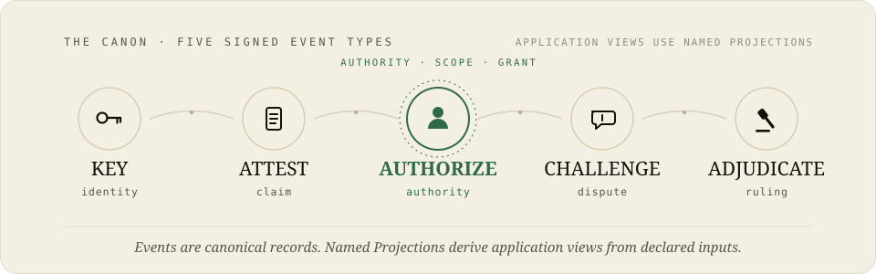

<h1 align="center">
  
</h1>

> ARC is an implementation-neutral authority protocol for AI agents and other delegated systems. It defines how authority is granted, narrowed, approved, revoked, contested, and adjudicated through portable signed records.

ARC began while exploring agentic commerce. The original question was how autonomous agents could buy, sell, negotiate, and act for people without turning every decision into a platform-specific trust rule. The deeper problem was not commerce itself. It was authority.

Who allowed the agent to act? What exactly was delegated? When was human approval required? What happens after revocation, compromise, disagreement, or conflicting claims? How can another implementation audit the answer without trusting one company's private database?

ARC extracts those recurring questions into a reusable protocol. Commerce remains its flagship application, but the protocol is designed for any domain where agents act under delegated authority.

**[Why ARC?](docs/why-arc.md)** — How ARC differs from authentication, OAuth tool access, MCP, and execution runtimes.

---

## Table of Contents

[Quick Start](#quick-start) · 1. [Why ARC Exists](#1-why-arc-exists) ·
2. [What ARC Defines](#2-what-arc-defines) ·
3. [The ARC Model](#3-the-arc-model) ·
4. [Authority & Delegation](#4-authority--delegation) ·
5. [Events & Projections](#5-events--projections) ·
6. [Executable Validation](#6-executable-validation) ·
7. [Flagship Application: Commerce](#7-flagship-application-commerce) ·
8. [Adoption Research](#8-adoption-research) ·
9. [Protocol Boundaries](#9-protocol-boundaries) ·
10. [Current Status](#10-current-status) ·
11. [Roadmap](#11-roadmap) ·
12. [Further Reading](#12-further-reading) ·
13. [License](#13-license)

---

## Quick Start

Run the complete executable probe catalog with Python 3. No services, API keys,
or database are required for the default run.

```sh
git clone https://github.com/shuu-beep/arc-protocol.git
cd arc-protocol
python3 run_demos.py          # all 14 probes, ~10s, offline
python3 run_demos.py --list   # probe names and one-line theses
```

Then inspect an individual probe:

```sh
python3 run_demos.py refusal
```

Each probe is a small, single-purpose Python program beside its own README under
[`examples/`](examples/).

---

## 1. Why ARC Exists

ARC did not begin as a general protocol project. It began with agentic commerce.

As the work expanded, the same failures appeared repeatedly across buying,
selling, delegation, approval, custody, disputes, and federation:

- an agent could act without clearly bounded authority,
- a valid signature could be mistaken for valid permission,
- approval could be separated from the action that was actually executed,
- revocation could be applied inconsistently,
- one system's authority record could not be interpreted by another,
- audit results could depend on hidden policy or cached state.

These were not commerce-specific problems. They were authority problems.

ARC was created to define that missing layer once, so different agents, models,
companies, and applications do not need to reinvent delegation and audit rules
inside every product.

The protocol therefore centers on five questions:

1. **Who has authority?**
2. **What is the exact scope of that authority?**
3. **What approval or delegation covers the action?**
4. **How can that authority be revoked, challenged, or adjudicated?**
5. **How can another observer recompute the result from signed evidence?**

---

## 2. What ARC Defines

ARC defines shared semantics for consequential action under delegated authority.

Its core commitments are:

- **Human-rooted authority** — every consequential act requires **Current Coverage**
  from a human-authored `AUTHORIZE`: either approval for the unchanged exact act or a valid scoped mandate.
- **Scoped delegation** — authority can move between agents without transferring
  private key material, and every delegation may narrow but never widen its own
  scope.
- **Portable authorization records** — authority evidence can be carried across
  systems and evaluated under declared profiles instead of remaining trapped in
  one platform's private database.
- **Revocation without rewriting history** — future authority can be removed
  while past signed records remain auditable.
- **Named recomputation** — authority, standing, reputation, and related views
  are derived by named Projections over identified signed Events and declared
  policy inputs.
- **Bounded audit** — an observer can verify what the available signed evidence
  supports without treating one implementation's cached score as canonical
  truth.

ARC is not an AI model, agent runtime, marketplace, payment rail, or global
reputation system. It is the authority-and-audit layer those systems can share.

---

## 3. The ARC Model

ARC uses a compact Event/Projection model.

### Canonical Events

The current protocol model uses five signed Event types:

- `KEY` — establishes or changes key-related claims,
- `ATTEST` — records a signed assertion,
- `AUTHORIZE` — grants approval or scoped authority,
- `CHALLENGE` — contests a prior claim or action,
- `ADJUDICATE` — records a ruling under declared authority.

Events may also use `nullifies` to revoke or supersede the future effect of
identified authority without deleting the historical record.

The executable corpus expresses its current scenarios with these five Event
types. That compact vocabulary is a present protocol result and the basis of the
current implementation.

### Derived Projections

Trust, reputation, standing, identity status, and current authority are not
stored as authoritative global state. They are computed as **named Projections**
over an identified Event set with declared version, policy, ordering, and as-of
inputs.

This separation is deliberate:

```txt
Signed Events  →  Named Projection  →  Recomputed authority or standing
```

An implementation may cache a Projection result for performance, but the cache
never becomes the protocol's source of truth.

---

## 4. Authority & Delegation

A consequential action requires **Current Coverage**.

Coverage may come from:

- an `AUTHORIZE` event approving the unchanged exact action, or
- an unexpired, unrevoked scoped mandate that covers the action.

Delegation is explicit and scoped. Authority is granted through an `AUTHORIZE`
Event carrying a `scope`. A delegate may narrow that authority but may not widen
its own mandate, and authority moves between agents without transferring private
key material.

The executable corpus demonstrates one fail-closed policy:

- proposals inside a valid mandate may proceed,
- unsupported or out-of-scope proposals stop or escalate to a human,
- revoked authority no longer covers future acts,
- past records remain available for audit,
- conflicting authority may resolve to `CONTESTED` under a declared policy.

ARC also keeps authority domains distinct. Human authority, agent authority,
community authority, and cross-system recognition are not silently merged. A
recipient remains free to honor or decline authority evidence from another
context under a compatible named profile.

Known open design questions, including quorum participation and cumulative
mandate consumption, are tracked in
[Event Registry §10](docs/event-registry.md#10-known-tensions-and-open-questions)
and
[Delegation & Spending Mandates §10](docs/delegation-and-spending-mandates.md#10-open-questions).

---

## 5. Events & Projections

<p align="center">
  
</p>

A commerce example can be represented as:

```txt
offer      → ATTEST
approval   → AUTHORIZE
dispute    → CHALLENGE
ruling     → ADJUDICATE
```

The resulting transaction state or reputation view is then computed by a named
Projection rather than written back as authoritative mutable state.

This gives ARC a clear audit boundary:

- signatures support verification of the signed bytes,
- authority coverage is evaluated from the relevant Events and policy,
- revocation and conflict remain visible in the record,
- derived results can be recomputed by another observer with the same evidence
  and declared inputs.

ARC records authority claims and transitions. It does not replace external
systems that establish identity assurance, wall-clock time, physical delivery,
legal truth, or faithful user-interface presentation. Within those boundaries,
ARC makes disclosed authority evidence portable, signed, and recomputable.

See [Object Model §5](docs/object-model.md#5-scoped-replay-and-recomputability)
for the full recomputation model.

---

## 6. Executable Validation

ARC is backed by an executable reference corpus rather than documentation alone.
The repository currently includes 14 runnable probes covering the protocol's
central authority and audit claims.

```txt
Executable Reference Corpus
✔ canonical Event and Projection behavior
✔ scoped delegation and revocation
✔ human approval boundaries
✔ signer, execution, view, and temporal fidelity seams
✔ key compromise and custody scenarios
✔ threshold authority
✔ federation behavior
✔ commerce failure catalog [A]–[H]
✔ browser reference client
✔ refusal-recording experiment
```

Run all probes with:

```sh
python3 run_demos.py
```

Representative examples:

- [`examples/canon-fold-demo`](examples/canon-fold-demo/) — folds governed
  disputes, key rotation, revocation, conflicting authority, and delegation with
  the five canonical Event types.
- [`examples/end-to-end-demo`](examples/end-to-end-demo/) — four parties produce
  their own signed records, and derived standing changes through `ADJUDICATE`
  rather than mutable stored scores.
- [`examples/reference-client`](examples/reference-client/) — exercises seven
  authority and approval surfaces, including cold start, compromise, federation,
  revocation, and custody seams.
- [`examples/local-commerce-demo`](examples/local-commerce-demo/) — runs an
  eight-case commerce failure catalog against the ARC authority model.
- [`examples/refusal-recording-demo`](examples/refusal-recording-demo/) — shows
  how explicit refusal records can be folded into a comparable research surface.

### Reference implementation stack

```txt
ARC Protocol
      ↓ semantics
ARC Reference Core
      ↓ authority projection
ARC Execution Gate
      ↓ application policy
dispatch
```

- **ARC Protocol** defines authority semantics. Its executable corpus currently
  passes 14 probes.
- **[ARC Reference Core](https://github.com/shuu-beep/arc-reference-core)**
  computes current authority coverage, conflict status, and reason codes from
  ARC evidence. It does not return application-level `ALLOW` or `DENY`
  decisions. The current alpha baseline passes 93 tests.
- **[ARC Execution Gate](https://github.com/shuu-beep/arc-execution-gate)**
  combines the Core result with application policy to create a pre-dispatch
  `GateDecision`. Its `software_deployment` consumer calls Reference Core
  directly. The current baseline passes 69 tests.

The `software_deployment` connection is a simulated, structural-only
integration. It does not establish production-grade signature verification,
root trust, key provenance, or evidence completeness, and it does not connect
to Cloudflare or a production deployment system.

The next level of validation is independent: external review, separate
implementations, adversarial testing, and real-world deployment experience.

---

## 7. Flagship Application: Commerce

Commerce is the problem that gave birth to ARC and remains its most developed
application profile.

Agentic commerce immediately exposes authority questions:

- May this agent spend at all?
- How much may it spend?
- For which purpose, merchant, asset, or time window?
- Does this exact transaction require fresh approval?
- What happens after a key compromise or revocation?
- Who may challenge or adjudicate the outcome?
- Can another system inspect the evidence without trusting the original
  platform's internal state?

ARC answers those questions at the authority layer. It does not replace payment,
settlement, logistics, identity providers, or courts.

The Commerce profile maps merchant assertions to `ATTEST`, human-granted
permission to `AUTHORIZE`, disputes to `CHALLENGE`, and rulings to `ADJUDICATE`.
Transaction state and reputation remain derived Projections.

The runnable Commerce implementation and failure catalog live in
[`examples/local-commerce-demo`](examples/local-commerce-demo/).

The same protocol model may later support other domains such as community
governance, licensing, research coordination, infrastructure operations, and
other forms of delegated agent action.

---

## 8. Adoption Research

A technically coherent protocol still has to survive contact with users,
implementers, institutions, and competing incentives.

ARC therefore treats adoption and refusal as research subjects rather than
assuming that technical merit guarantees use.

- [`docs/adoption-and-defection.md`](docs/adoption-and-defection.md) examines
  WAIT, DEFECT, FORK, and REJECT responses.
- [`docs/first-refusal-protocol.md`](docs/first-refusal-protocol.md) defines a
  procedure for recording the first serious external refusal as useful evidence.
- [`docs/coordination-economics-survey.md`](docs/coordination-economics-survey.md)
  compares adoption and displacement patterns in open protocols.
- [`docs/pilot-design.md`](docs/pilot-design.md) outlines a limited real-world
  pilot focused on learning.

The current refusal demo validates the recording mechanism with synthetic data.
The real dataset begins with external review and first contact.

---

## 9. Protocol Boundaries

ARC defines authority semantics. It does not prescribe one infrastructure,
business model, governance topology, storage engine, or settlement network.

Implementations may use PostgreSQL, SQLite, append-only logs, object storage,
message streams, shared ledgers, or combinations of them, provided their
interoperability claims identify the relevant protocol profiles and inputs.

ARC also does not initiate or settle payments. A Commerce implementation hands
off an authorized action to external payment or settlement rails. Those systems
retain their own refund, chargeback, compliance, custody, and recovery rules.

Community adjudication inside an ARC profile does not replace courts,
consumer-protection law, professional regulation, or regulated identity
assurance. See [Liability Boundaries](docs/liability-boundaries.md) and
[Identity](docs/identity.md).

---

## 10. Current Status

ARC currently provides:

- a defined Event/Projection authority model,
- five canonical signed Event types,
- scoped delegation and revocation semantics,
- named recomputation of authority and standing,
- a browser reference client,
- 14 executable probes,
- a Commerce application profile and failure catalog,
- federation, custody, compromise, threshold, and fidelity tests,
- adoption and refusal research procedures.

The complete reference corpus runs today and passes its current executable test
catalog.

ARC is not yet a finished production standard. The next work includes a
normative wire and security profile, a fuller conformance suite, independent
implementations, external protocol review, adversarial testing, and limited
real-world pilots.

---

## 11. Roadmap

The full roadmap is in [docs/roadmap.md](docs/roadmap.md).

- **Reference corpus — current.** Canonical model, probes, reference client,
  Commerce failure catalog, and adoption experiments.
- **External review.** Obtain independent technical, security, protocol-design,
  and implementation feedback.
- **Specification.** Define the normative envelope, error model, versioning,
  transport profiles, signature/security profiles, and conformance tests.
- **Independent implementations.** Test whether separate teams can reproduce the
  same authority results from the specification.
- **Pilot.** Run a limited real-world deployment designed to reveal failures and
  missing semantics.
- **Additional profiles.** Explore governance, licensing, research coordination,
  and other authority-sensitive domains.

---

## 12. Further Reading

**Core semantics**
[Object Model](docs/object-model.md) ·
[Event Registry](docs/event-registry.md) ·
[Authority & Conflict](docs/authority-and-conflict.md) ·
[Delegation & Spending Mandates](docs/delegation-and-spending-mandates.md)

**Protocol development**
[Glossary](docs/glossary.md) ·
[Future Protocol Spec](docs/future-protocol-spec.md) ·
[Key Custody](docs/key-custody.md) ·
[Why ARC?](docs/why-arc.md) ·
[Trust Model Trade-offs](docs/trust-model-tradeoffs.md) ·
[Landscape & Positioning](docs/landscape-and-positioning.md) ·
[Liability Boundaries](docs/liability-boundaries.md) ·
[Identity](docs/identity.md)

**Executable validation**
[Probe Catalog](examples/) ·
[Reference Client](examples/reference-client/) ·
[Local Commerce Demo](examples/local-commerce-demo/) ·
[Refusal-Recording Demo](examples/refusal-recording-demo/)

**Commerce profile**
[Architecture](docs/architecture.md) ·
[Protocol Mechanics](docs/protocol.md) ·
[Local Commerce Simulation](docs/local-commerce-simulation.md) ·
[Reputation](docs/reputation.md) ·
[Governance](docs/governance.md) ·
[Threat Model](docs/threat-model.md)

**Origins and research**
[Philosophy](docs/philosophy.md) ·
[Agent-Mediated Commerce & Infrastructure](docs/agent-mediated-commerce-infrastructure.md) ·
[Adoption & Defection](docs/adoption-and-defection.md) ·
[First Refusal Protocol](docs/first-refusal-protocol.md) ·
[Coordination-Economics Survey](docs/coordination-economics-survey.md) ·
[Pilot Design](docs/pilot-design.md) ·
[Bootstrap & Incentives](docs/bootstrap-and-incentives.md)

---

## 13. License

This project is licensed under the Apache License 2.0. See the LICENSE file for
details.

<p align="center">
  
</p>
