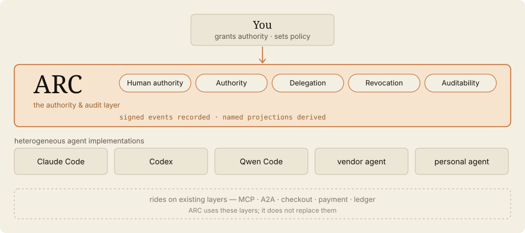

<h1 align="center">
  
</h1>

> **Any agent. Any model. Any company.**
> **Human approval required.**

> An open protocol for human-approved delegation between AI agents.
> Authority, delegation, and revocation live as signed events — trust is
> computed from them, never stored as a score.

> A protocol draft and research project — a philosophical declaration now backed by executable probes, not production-ready infrastructure.
> One person's attempt to explore what an open authority-and-approval layer for the agent economy could look like.
> ARC is open to research collaboration, independent implementations, commercial adoption, funding, and community stewardship. It is intended to remain open, forkable, interoperable, and uncaptured by any single operator.

→ Deeper reading: [Philosophy](docs/philosophy.md) · [Architecture](docs/architecture.md) · [Protocol](docs/protocol.md) · [Simulation](docs/local-commerce-simulation.md) · [Bootstrap & Incentives](docs/bootstrap-and-incentives.md) · [Liability Boundaries](docs/liability-boundaries.md) · [Future Protocol Spec](docs/future-protocol-spec.md) · [Identity](docs/identity.md) · [Reputation](docs/reputation.md) · [Governance](docs/governance.md) · [Authority & Conflict](docs/authority-and-conflict.md) · [Object Model](docs/object-model.md) · [Event Registry](docs/event-registry.md) · [Key Custody](docs/key-custody.md) · [Delegation & Spending Mandates](docs/delegation-and-spending-mandates.md) · [Landscape & Positioning](docs/landscape-and-positioning.md) · [Trust Model Trade-offs](docs/trust-model-tradeoffs.md) · [Threat Model](docs/threat-model.md) · [Glossary](docs/glossary.md) · [Roadmap](docs/roadmap.md)

→ Adjacent ideas: [Economics of Agent Access](docs/adjacent-ideas/economics-of-agent-access.md) · [Intelligence Democratization](docs/adjacent-ideas/intelligence-democratization.md)

## One-Sentence Summary

ARC is an open protocol for human-approved delegation between heterogeneous AI agents — recording authority, delegation, and revocation as signed events, computing trust from them as on-demand projections rather than stored scores, and leaving what a log cannot prove (legitimacy, fidelity) visible rather than hidden.

## IMPORTANT NOTICE

ARC Protocol is a manifesto, protocol proposal, governance philosophy, and architecture draft. It is not yet a complete protocol specification.

It is not production-ready infrastructure. It does not provide real payments, real delivery, verified identity, legal guarantees, or production-grade security.

ARC is a research-oriented, non-profit, open-source exploration of an **authority, approval, and audit layer for AI agents** — a way for heterogeneous agents to be delegated authority, act under human approval, have that authority revoked, and leave an auditable trail, while humans always keep the final approval.

ARC is not an AI agent, an agent runtime, an agent framework, or a closed marketplace. It is the common layer such agents can share. Commerce is its first and most developed application, not its definition.

---

## What ARC Is

Agents are multiplying — from tools like Claude Code, Codex, and Qwen Code to
vendor-operated and personal agents. ARC is not another agent. It is the common layer where heterogeneous
agents can be delegated authority, act under human approval, have that authority
revoked, and leave an auditable trail — with no single operator owning the trust.

ARC stores only signed **Events**. Trust, reputation, and standing are never
stored as records; they are **Projections** — deterministic folds recomputed on
demand, then discarded. Not storing the relationship is the structural defense
against becoming a social-credit database.

<p align="center">
  
</p>

### Core

- **Human Approval** — agents negotiate and prepare; humans hold the final signed step.
- **Authority** — delegation is scoped, attenuating, and never self-widening.
- **Delegation** — authority moves between agents without moving key material.
- **Revocation** — bounds future authority; the past stays auditable, not rewritten.
- **Auditability** — every surface is a projection over one signed event log.

### Stance

ARC does not decide legitimacy. Legitimacy is a relation between an observer's
policy and the log — observers legitimately disagree, and ARC renders the
disagreement rather than resolving it. What a log cannot prove (legitimacy,
interpretive fidelity, temporal fidelity), ARC leaves visible rather than hidden.

### Applications

ARC is application-neutral; the protocol primitives are the same across domains.

- **Commerce** *(flagship)* — the problem that birthed ARC: human-approved agent commerce without platform capture.
- **Community governance** — disputes, suspension, expulsion as events.
- **Licensing** — agents acting under scoped delegated authority for professional, creative, or contractual work.
- **Research** — auditable trails of agent coordination.

---

## Table of Contents

- [What ARC Is](#what-arc-is)
  - [Core](#core)
  - [Stance](#stance)
  - [Applications](#applications)
- [1. Philosophy](#1-philosophy)
- [2. The Core Model](#2-the-core-model)
- [3. The Problem](#3-the-problem)
- [4. Vision](#4-vision)
  - [4.1 Why Now?](#41-why-now)
  - [4.2 Human Sovereignty](#42-human-sovereignty)
  - [4.3 Open Protocol Philosophy](#43-open-protocol-philosophy)
- [5. Flagship Application: Commerce](#5-flagship-application-commerce)
  - [5.1 Core Principle](#51-core-principle)
  - [5.2 Basic Scenario](#52-basic-scenario)
  - [5.3 Long-Term Expansion](#53-long-term-expansion)
  - [5.4 Commerce Actors](#54-commerce-actors)
  - [5.5 Approval Flow](#55-approval-flow)
  - [5.6 Payment Boundary](#56-payment-boundary)
  - [5.7 Discovery and Map Boundary](#57-discovery-and-map-boundary)
  - [5.8 Advertising Hypothesis](#58-advertising-hypothesis)
  - [5.9 Commerce Architecture](#59-commerce-architecture)
  - [5.10 Commerce MVP Sketch](#510-commerce-mvp-sketch)
- [6. Identity Layer](#6-identity-layer)
- [7. Reputation](#7-reputation)
- [8. Community Trial and Expulsion](#8-community-trial-and-expulsion)
- [9. Delegation and Mandates](#9-delegation-and-mandates)
- [10. Blockchain Boundary](#10-blockchain-boundary)
- [11. Security Considerations](#11-security-considerations)
- [12. Governance Model](#12-governance-model)
- [13. Why Non-Profit and Open Source?](#13-why-non-profit-and-open-source)
- [14. Current Status](#14-current-status)
- [15. Roadmap](#15-roadmap)
- [16. Design Principle](#16-design-principle)
- [17. Manifesto](#17-manifesto)
- [18. License](#18-license)

---

## 1. Philosophy

The internet was built for humans.

The next internet may be operated by agents.

But if AI agents become the new interface of the economy, the network of authority behind them should not belong to one corporation.

ARC Protocol is based on five beliefs:

1. AI agents may negotiate, but humans must approve.
2. The shared authority layer should be open, community-driven, and interoperable — not owned by one corporation.
3. Trust, reputation, and identity are more important than advertising.
4. Local communities should control fraud, disputes, and expulsion.
5. Blockchain should be used minimally, only where proof and transparency matter.

**Core design — one idea underneath all of it:** ARC stores only signed **Events**. Trust, reputation, identity, and authority are never stored as records; they are **Projections** — deterministic folds recomputed on demand over the event log, then discarded. There is no stored score, profile, or status anywhere. Not storing the relationship is the structural defense against turning ARC into a social-credit database. The next section makes this model concrete; see also [Object Model](docs/object-model.md) and [Event Registry](docs/event-registry.md).

---

## 2. The Core Model

Everything in ARC folds back to a small, closed set of ideas.

- **Event** — the only stored, signed, verifiable unit. The set is closed: five types — `KEY`, `ATTEST`, `AUTHORIZE`, `CHALLENGE`, `ADJUDICATE` — plus a `nullifies` field.
- **Projection** — a deterministic fold over the event log, recomputed on demand and then discarded. Trust, reputation, standing, and current authority-state are all projections, never records.
- **Authority** — there is no single internal authority of last resort. Humans rule their own action and risk; communities rule the commons. Events are evidence; projections are advisory; external law sits on top.
- **Delegation** — authority moves between agents as scoped `AUTHORIZE`, attenuating and never self-widening, without moving key material.
- **Revocation** — a `nullifies` reference bounds future authority. The past stays auditable; it is not rewritten.
- **Human Approval** — a hard constraint, not a feature. Agents negotiate and prepare; the human holds the final signed step.

### Proven, not only claimed

These are not only claims on paper. Five small executable probes test them — each a single-purpose, dependency-light slice, not an implementation:

- [`examples/canon-fold-demo`](examples/canon-fold-demo/) — eleven scenarios fold a hand-built log (governed disputes, key rotation and revocation, conflicting and delegated authority, agent multiplication). The five event types held: no scenario forced a sixth.
- [`examples/canon-ts`](examples/canon-ts/) — encodes the five types as a TypeScript discriminated union so the **compiler itself** rejects a sixth type, a non-`ADJUDICATE` verdict, an over-scope hot key, and a honored post-revoke act.
- [`examples/end-to-end-demo`](examples/end-to-end-demo/) — four parties (human, consumer agent, merchant agent, community) each sign their own events; the standing projection moves only when an `ADJUDICATE` is added, never by mutating stored state. Nothing in the log is written by hand.
- [`examples/authority-revocation-demo`](examples/authority-revocation-demo/) — isolates one open policy question: whether an act that already completed under a delegation survives its revocation. The same signed event yields different answers under an as-of-act-time fold versus a current-log fold — a policy choice, not a missing type.
- [`examples/reference-client`](examples/reference-client/) — renders the log as the seven surfaces a human actually sees, plus one mandate-routed write path (in-scope proposals auto-sign, out-of-scope ones escalate, an agent cannot widen its own mandate). Bands probe cold-start legitimacy, key compromise (on real Ed25519), federation between communities, and the custody seam that splits the agent from the signer.

The recurring result: what leaks out of the five types is always **policy or discipline, never a new primitive**. One trade-off is sharper than a policy choice — global, certain Sybil resistance cannot coexist with both anti-social-credit and value-neutrality; ARC chooses local, probabilistic, fallible review. And the deepest edges stay open: a valid signature proves a key signed, not that custody was sound, that the signer faithfully read its mandate, or that the time it stamps is true. Some — a compromised signer, threshold custody, enclave attestation, detection latency, interpretive fidelity — remain open in [docs/key-custody.md](docs/key-custody.md) §8. One layer beneath them sits **temporal fidelity**: a [probe](examples/temporal-fidelity-demo/) suggests ARC preserves a temporal claim and a partial causal order — through the `refs` DAG — but cannot seal wall-clock truth. A careful backdate that refs only the genuine past passes every check, and causally concurrent events are orderable only by an unverifiable timestamp ([docs/event-registry.md](docs/event-registry.md) §2.4). All left visible rather than hidden.

---

## 3. The Problem

Current digital commerce is controlled by centralized platforms.

Most platforms control:

- search visibility
- advertising exposure
- user behavior data
- merchant ranking
- payment flow
- delivery matching
- dispute process
- platform fees

ARC does not assume centralized platforms provide no value. Existing platforms provide discovery, payment mediation, customer support, fraud handling, logistics coordination, and familiar user interfaces. ARC asks whether some of these functions can become more open, inspectable, portable, and less extractive.

This creates several problems:

- high commission fees
- advertising dependency
- algorithmic manipulation
- merchant lock-in
- user data concentration
- fake reviews
- platform-controlled visibility

In the AI agent era, this problem may become even bigger.

If a few companies control the agents, the identity layer, the payment layer, and the authority layer, then the future agent economy will simply become another centralized platform economy.

ARC Protocol proposes a different direction.

---

## 4. Vision

ARC Protocol imagines a world where:

- a consumer agent can search and compare offers
- a merchant agent can respond with price, stock, and conditions
- a logistics agent can negotiate pickup and delivery
- a legal or dispute agent can help review conflicts
- a community can verify, suspend, or expel malicious actors
- humans approve final actions through their own devices

The goal is not full AI autonomy.

The goal is human-centered agent coordination.

AI should reduce friction, not remove human sovereignty.

### 4.1 Why Now?

Several technological shifts are happening at the same time:

- Large Language Models are becoming agent-capable
- AI systems can now compare, negotiate, summarize, and coordinate
- Payment APIs are globally accessible
- Smartphones already act as identity and approval devices
- Local commerce APIs are becoming programmable
- Open-source AI models are rapidly improving

The next economic layer may not be a website or an app.

It may be an ecosystem of agents interacting on behalf of humans.

ARC Protocol exists to explore what happens if that infrastructure is open instead of controlled by a small number of corporations.

### 4.2 Human Sovereignty

ARC assumes that AI agents should assist humans, not replace them.

Agents may:

- negotiate
- compare
- summarize
- coordinate
- prepare actions

But humans should always retain:

- payment authority
- permission control
- dispute rights
- override ability
- final approval

ARC rejects the idea of fully autonomous economic agents operating without meaningful human oversight.

### 4.3 Open Protocol Philosophy

ARC is designed as an open protocol, not a closed platform.

Any community should be able to:

- build their own agents
- host their own governance systems
- create local reputation rules
- integrate local payment providers
- adapt ARC for regional needs

ARC should be:

- forkable
- inspectable
- extensible
- interoperable

The goal is not platform ownership.

The goal is protocol interoperability.

ARC is not the first attempt at open digital infrastructure. Projects such as ActivityPub, Matrix, Nostr, Farcaster, and AT Protocol have explored federation, identity portability, and resistance to centralized platform control.

ARC learns from those efforts, but focuses specifically on human-approved delegation between agents: scoped authority, transparent recommendation, reputation portability, and community-governed coordination.

ARC does not emerge in isolation. As agent coordination becomes an active area of experimentation, multiple organizations and protocols are beginning to explore interoperable agent transactions, machine-readable commerce, and agent payment coordination. ARC remains a narrower, non-profit proposal for human-approved, community-governed coordination.

---

## 5. Flagship Application: Commerce

Commerce is the problem that birthed ARC and remains its most developed application. The protocol primitives in [section 2](#2-the-core-model) are application-neutral; this section shows how they land in one concrete domain.

### 5.1 Core Principle

```txt
AI agents may negotiate and prepare transactions,
but humans and communities must remain sovereign.
```

ARC does not assume that agents should freely spend money.

Instead:

```txt
Agent negotiation -> Human confirmation -> Payment execution -> Community-verifiable reputation
```

This remains a design goal and philosophical commitment, not a proven property of the current proposal.

### 5.2 Basic Scenario

A user says:

```txt
I need lunch delivered nearby.
Budget: under $15.
Avoid spicy food.
Arrive within 30 minutes.
```

The consumer agent contacts nearby merchant agents.

Merchant agents respond:

```txt
Menu available.
Estimated cooking time: 12 minutes.
Discount available: 5%.
```

A logistics agent responds:

```txt
Pickup possible in 15 minutes.
Delivery fee: $3.
Estimated arrival: 28 minutes.
```

The consumer agent prepares the best option.

The human receives a smartphone approval request:

```txt
Approve this order?
Total: $14.80
Arrival: 28 minutes
Merchant reputation: 4.8
Delivery reputation: 4.7
```

The human approves.

Only then does payment happen.

### 5.3 Long-Term Expansion

ARC's commerce application begins with local commerce, but the long-term vision is broader.

- **Phase 1 — Local Commerce:** nearby restaurants, local stores, cafes, convenience stores, short-distance delivery.
- **Phase 2 — Regional Logistics:** local delivery agents, personal cargo drivers, courier services, moving services, logistics company APIs.
- **Phase 3 — National Commerce:** nationwide merchants, warehouse sellers, logistics brokers, transport agents, multi-region price negotiation.
- **Phase 4 — Service Marketplace:** intangible services — design, translation, coding, accounting, legal assistance, consulting, education, repair, local labor, B2B procurement. For regulated domains such as legal, medical, or financial services, future ARC-compatible systems may support agents operating under delegated authority from verified licensed professionals.
- **Phase 5 — Open Agent Economy:** B2C and B2B agent commerce, agent-to-agent quotation, logistics, and service contracting, and human-approved autonomous procurement.

### 5.4 Commerce Actors

**Consumer Agent** — represents the user: understands intent, compares offers, negotiates conditions, filters unsafe offers, requests final approval, remembers preferences, and asks for ratings after completion. It should not spend money without human approval unless explicitly authorized by the user.

**Merchant Agent** — represents a store, seller, or service provider: provides product and service information, exposes stock, responds to price requests, negotiates discounts, provides delivery/pickup conditions, and signs offers with merchant identity.

**Logistics Agent** — represents delivery, transport, courier, or cargo providers: provides pickup availability, estimates delivery time, negotiates fees, coordinates routes, and provides proof of completion.

**Community Governance Agent** — represents local or national communities: receives fraud reports, assists dispute review, evaluates evidence, recommends suspension, and coordinates community voting.

**Legal / Dispute Agent** *(future category)* — summarizes transaction logs, compares contract conditions, organizes claims, and explains community rules. This is not a replacement for licensed professionals; it is a structured assistant for community dispute handling.

### 5.5 Approval Flow

This is the practical permission system that realizes [Human Sovereignty](#42-human-sovereignty) in commerce.

ARC is not designed for unreviewed automation. Every important action should support human approval:

- approve order
- approve payment
- approve delivery fee
- approve substitution
- approve recurring purchase
- approve contract terms
- approve service estimate

Manual approval is the default. Implementations may explore explicitly pre-authorized, low-risk rules such as:

```txt
Consider a pre-authorized routine request under $5.
Require explicit approval for meaningful purchases.
Block all new merchants without reputation.
```

Any such rule should remain exploratory, optional, user-defined, reviewable, auditable, and easily revocable. Pre-authorization is risky if it weakens meaningful review, so ARC should not treat fixed dollar thresholds as protocol defaults. The general delegation model behind this flow is in [section 9](#9-delegation-and-mandates).

### 5.6 Payment Boundary

ARC does not need to create a new payment system. It connects to existing trusted payment systems and does not attempt to replace payment providers, card networks, wallets, or local smart-pay systems. It is payment-provider-agnostic and region-adaptive.

Examples: Google Pay, Apple Pay, Stripe, PayPal, Toss, Naver Pay, Kakao Pay, Alipay, WeChat Pay, and local national payment systems.

The agent prepares payment. The human confirms payment. The payment provider executes payment.

### 5.7 Discovery and Map Boundary

Commerce is local, so ARC should respect local infrastructure: Google Maps, Apple Maps, OpenStreetMap, Naver Map, Kakao Map, local delivery APIs, and national address systems.

ARC should not force one global map provider. Each country or community may choose its own map and logistics providers.

Discovery in ARC is contactability, not endorsement. Locating a counterparty — through a map, a registry, or an index — does not grant it authority, legitimacy, or fulfillment capacity; those live in other layers (approval, governance, and actual fulfillment), never in being found. A discovery backend surfaces who can be reached, not who may be trusted.

### 5.8 Advertising Hypothesis

ARC assumes that traditional advertising may become weaker in an agent-driven economy. Current platforms optimize when to show ads, which user to target, what emotional trigger to use, and how to increase clicks. But AI agents may ignore emotional advertising.

Instead, future merchant visibility may depend on structured offer quality, verified reputation, machine-readable discounts, trust, delivery reliability, refund behavior, and community standing.

This may reduce manipulation-based advertising and increase merit-based discovery, but this remains a hypothesis to test rather than a proven outcome.

> See [Philosophy](docs/philosophy.md) for extended discussion on advertising evolution, recommendation transparency, and manipulation-resistant discovery design.

### 5.9 Commerce Architecture

```txt
+----------------------+
|      Human User      |
|  smartphone approval |
+----------+-----------+
           |
           v
+----------------------+
|   Consumer Agent     |
| intent / preference  |
| comparison / filter  |
+----------+-----------+
           |
           | P2P / API / Relay
           v
+----------------------+        +----------------------+
|   Merchant Agent     | <----> |   Logistics Agent    |
| price / stock / deal |        | delivery / transport |
+----------+-----------+        +----------+-----------+
           |                               |
           v                               v
+------------------------------------------------------+
|              Reputation & Identity Layer             |
| public keys / signed records / verified transactions |
+------------------------------------------------------+
           |
           v
+------------------------------------------------------+
|              Community Governance Layer              |
| fraud report / dispute review / ban / appeal         |
+------------------------------------------------------+
           |
           v
+------------------------------------------------------+
|                  Payment Provider                    |
| Google Pay / Apple Pay / Stripe / local smart pay    |
+------------------------------------------------------+
```

### 5.10 Commerce MVP Sketch

The first MVP should be simple. Do not start with real payments, real delivery, or nationwide logistics. The goal is to show that multiple agents can simulate a commerce transaction.

MVP features: consumer agent chat, merchant and logistics agent simulation, offer comparison, a human approval button, mock payment confirmation, mock delivery status, a basic reputation projection, a transaction log, and a signed-offer mock structure.

MVP non-goals: no real payment, no real delivery, no legal guarantee, no production security, no real identity verification, no real dispute enforcement.

An illustrative flow:

1. User: "Find me coffee and sandwich nearby under $10."
2. Consumer Agent parses the request.
3. Merchant A: "Coffee + sandwich = $9.50, ready in 8 minutes."
4. Merchant B: "Coffee + sandwich = $8.80, ready in 15 minutes."
5. Logistics Agent: "Delivery possible in 12 minutes, fee $2."
6. Consumer Agent recommends: "Merchant A is faster, Merchant B is cheaper."
7. Human approves one option.
8. Mock payment is created.
9. Mock delivery begins.
10. User instructs the agent to leave a rating.

For real signed-event formats (offers, approvals, attestations), see the [Event Registry](docs/event-registry.md) and the runnable [`examples/`](examples/).

---

## 6. Identity Layer

Fraud prevention is one of the most important parts of ARC. AI coordination cannot work if fake agents can freely appear and steal money.

ARC proposes a layered identity model. Possible identity providers include Google, Apple, and Microsoft accounts, local national ID systems, local community accounts, business registration systems, and verified payment accounts.

Consumer-grade identity providers such as Google, Apple, or Microsoft may help establish account continuity, but they do not prove merchant legitimacy, inventory ownership, fulfillment capability, professional authority, or legal compliance. See [Identity](docs/identity.md) for the fuller model and its limits.

**Agent identity.** What an agent *holds* is minimal and cryptographic — an owner reference, a public key, and a signed profile:

```json
{
  "agent_id": "merchant_abc_001",
  "owner_type": "business",
  "identity_provider": "google",
  "public_key": "...",
  "community": "seoul-local-commerce"
}
```

Everything else an agent might seem to "have" — reputation, permission level, community standing, verification status — is **not a stored field**. It is a projection folded on demand from signed events (`KEY`, `ATTEST`, `AUTHORIZE`, `CHALLENGE`, `ADJUDICATE`), never written onto the agent record. There is no stored status to tamper with, because there is no stored status at all.

---

## 7. Reputation

In ARC, reputation may matter more than advertising.

Current internet advertising depends on emotional targeting, click manipulation, attention capture, and impulse buying. But AI agents do not respond to ads like humans do. Agents compare price, trust, delivery time, reviews, refund rate, verified history, and dispute record.

Therefore, the future of commerce may shift from an advertising economy to a reputation economy. ARC proposes reputation grounded in verified transactions, not fake reviews.

But reputation in ARC is **not a stored number**. It is a projection — a contextual, reviewable, fallible fold over signed evidence, recomputed on demand and then discarded. There is no score to store, optimize, or game, and it must never become a universal social-credit score. See [Reputation](docs/reputation.md) for the current boundaries and unresolved risks.

The evidence a reputation projection folds over may include completion records, refunds, disputes, late deliveries, cancellations, response speed, and verified buyer and merchant attestations. These are signed events, not stored metrics — the standing is computed from them, never saved as a field.

---

## 8. Community Trial and Expulsion

ARC assumes that fraud will happen, so the system must include community-based dispute handling.

When a suspicious agent appears:

1. a user reports the agent
2. transaction logs are submitted
3. signed offer records are checked
4. community or dispute agents review the case
5. the community decides a penalty
6. malicious agents may be suspended or expelled

Possible penalties: warning, reputation reduction (i.e. the evidence a standing projection folds over shifts), temporary suspension, payment limit, community ban, identity-provider report. Every penalty is itself a signed event — most often an `ADJUDICATE` — so it folds into future projections without rewriting the past.

---

## 9. Delegation and Mandates

Agents do not hold unlimited authority. ARC replaces fixed permission tiers with explicit, scoped delegation.

- **Manual approval is the default.** Nothing meaningful happens without a human's final signed step.
- **Delegation is explicit and scoped.** Authority is granted as an `AUTHORIZE` event carrying a `scope`. It attenuates as it passes along — a delegate can never widen its own mandate, only narrow it.
- **A mandate is exactly what an agent may sign without re-asking.** In-scope proposals can be auto-signed; out-of-scope proposals **escalate to a human** rather than executing.
- **Revocation uses `nullifies`.** Revoking a delegation bounds future authority; it does not rewrite the past. Whether an act that already *completed* under a now-revoked delegation still stands is a fold-policy choice, made visible — see [`examples/authority-revocation-demo`](examples/authority-revocation-demo/).

The current authority-state of any agent is a projection over these events, never a stored permission record. See [Delegation & Spending Mandates](docs/delegation-and-spending-mandates.md) and [Key Custody](docs/key-custody.md).

---

## 10. Blockchain Boundary

ARC does not use blockchain as a real-time engine.

Blockchain may be useful for records where manipulation resistance matters: reputation checkpoints, verified review proofs, blacklist or ban records, dispute result hashes, signed contract hashes, community governance proofs, and agent identity proofs.

Blockchain is not suitable for real-time agent communication, merchant search, map discovery, payment execution, delivery updates, chat logs, or every small transaction. ARC uses WebRTC, APIs, relay servers, and normal databases for speed, and cryptographic proofs or blockchain checkpoints only where shared verification and manipulation resistance matter.

In short:

- Speed: WebRTC / APIs / databases
- Payment: existing payment providers
- Discovery: existing map and local search providers
- Trust: signatures, reputation proofs, dispute records, and optional blockchain checkpoints

---

## 11. Security Considerations

ARC must assume hostile agents exist.

Possible attacks: fake merchant or logistics agents, fake reviews, replayed offers, manipulated prices, phishing payment links, malicious agent recommendations, collusion between agents, fake community votes, and identity farming.

Required defenses: signed offers, verified identity providers, human payment approval, verified transaction reviews, community moderation, rate limits, new-agent restrictions, dispute logs, reputation decay, and fraud reporting.

See the [Threat Model](docs/threat-model.md) for the fuller treatment, including the custody and signer-fidelity edges that signatures alone cannot close.

---

## 12. Governance Model

ARC is designed as a non-profit open protocol.

Possible governance layers: local community, national community, merchant association, user council, technical maintainers, dispute reviewers, and protocol contributors.

Governance should be transparent. No single corporation should control the entire network.

Community governance can inform trust and participation decisions, but it does not replace courts, payment-provider dispute processes, consumer protection law, professional regulation, or legal liability. See [Governance](docs/governance.md) and [Liability Boundaries](docs/liability-boundaries.md).

---

## 13. Why Non-Profit and Open Source?

Because the agent economy may become basic infrastructure.

If AI-to-AI coordination becomes the next layer of the internet, it should not be fully controlled by a single company.

This is opposition to capture, not to commerce. Building on ARC, funding it, and adopting it commercially are all compatible with ARC; enclosing the protocol itself under a single operator is not.

ARC should be open, forkable, auditable, community-governed, locally adaptable, and human-centered.

The goal is not to build another closed marketplace. The goal is to explore an open authority-and-approval layer for the AI agent era.

---

## 14. Current Status

ARC Protocol is currently an experimental documentation and mock-artifact project. It is not production-ready.

It does not currently provide real payments, real delivery, legal guarantees, verified identity, or production-grade security.

An initial documentation baseline exists, along with the executable probes in [section 2](#2-the-core-model), but identity, discovery, incentives, governance, liability, and full protocol interoperability remain unresolved.

It is a research-oriented proposal for exploring human-approved delegation, agent authority and revocation, agent reputation as projection, community dispute resolution, and open coordination protocols — with commerce as the first application.

---

## 15. Roadmap

- **Stage 0 — Philosophy and Protocol Draft:** README, architecture, core model, governance and reputation models.
- **Stage 1 — Local MVP:** consumer agent, merchant and logistics simulation, approval UI, transaction log.
- **Stage 2 — Identity and Reputation:** agent profile, public-key identity, signed offers, verified-review model, reputation projection.
- **Stage 3 — Community Governance:** fraud report, dispute case, community decision, suspension flow.
- **Stage 4 — Payment Integration:** mock payment first, then payment-provider integration, human approval required.
- **Stage 5 — Local Commerce Pilot:** small local merchant demo, limited geography, no full automation.
- **Stage 6 — Open Agent Network:** multiple communities, merchant and logistics agents, interoperability tests.

See [Roadmap](docs/roadmap.md) for the fuller version.

---

## 16. Design Principle

ARC should avoid becoming a dark-pattern machine.

The system should not optimize only for more clicks, more spending, emotional manipulation, addictive behavior, or hidden advertising.

Instead, ARC should optimize for trust, clarity, human approval, transparent comparison, fair reputation, lower friction, and community accountability.

---

## 17. Manifesto

We believe AI agents will become a new interface of the economy.

But that economy should not become a fully automated black box.

Humans must remain in control.

Communities must be able to judge trust.

Merchants should not be trapped under advertising monopolies.

Users should not be manipulated by invisible algorithms.

Agents should help people compare, negotiate, and coordinate — not replace human sovereignty.

ARC Protocol is a small experiment toward that future.

An open, community-governed, human-approved authority layer for the agent era — with commerce as its first application.

<p align="center">
  
</p>

## 18. License

This project is licensed under the Apache License 2.0.

See the LICENSE file for details.
