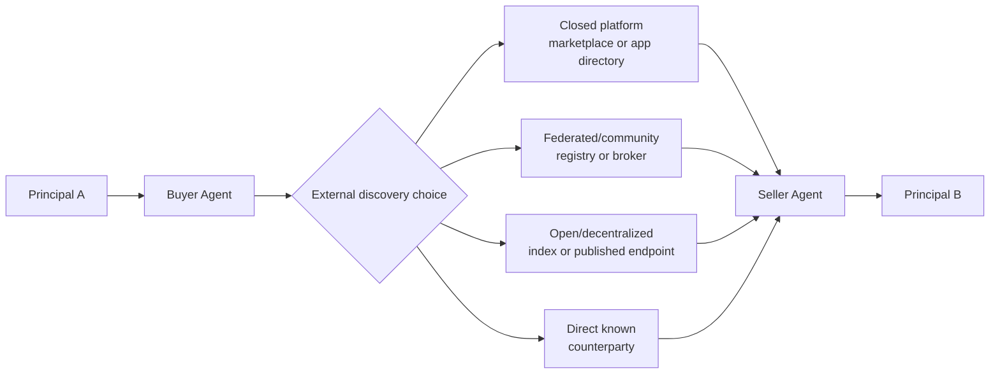

# ARC Commerce Application: Discovery Topology Choices

> **Status:** Non-normative application boundary diagram
> **Purpose:** Show how independent counterparties may find one another without
> making discovery an ARC service or Canon concern.

## Boundary

- ARC does not prescribe, operate, or certify a discovery provider.
- Discovery may be centralized, federated, community-operated, open,
  decentralized, or direct. No option is canonical.
- A directory result, ranking, Agent Card, endpoint, or marketplace listing is
  not proof of identity, current authority, inventory, reputation, or honesty.
- Contact and capability exchange are transport/application messages. They do
  not become ARC Events unless an application deliberately records a relevant
  signed claim using the existing Canon.
- Sponsored placement, suppression, stale listings, Sybil entries, and
  selective visibility remain discovery/application threats.

After discovery, an application may use A2A, HTTP, FIPA interaction patterns,
UCP, ACP, or another transport and commerce protocol. ARC's separate question
is how declared signed authority and standing evidence is interpreted when the
counterparties interact.

See [Architecture](../docs/architecture.md),
[Landscape and Positioning](../docs/landscape-and-positioning.md), and the
[Threat Model](../docs/threat-model.md).
