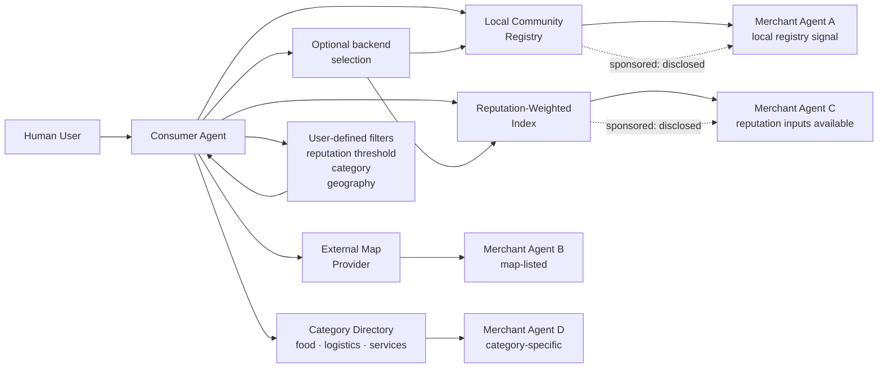

# ARC Commerce Reference Application: Discovery Topology

> **Purpose:** Visual reference for the Commerce flagship application's multi-backend discovery policy
> This diagram describes application policy, not ARC Canon.
> For discovery layer detail, see [docs/architecture.md](../docs/architecture.md).
> For sponsored discovery and manipulation risks, see [docs/threat-model.md](../docs/threat-model.md).

## Topology Diagram

## Notes

- Within this Commerce profile, any discovery backend may include sponsored placement only when it is disclosed under that application policy.
- This Commerce profile models user-selectable backends. That is an application backend-choice policy, not ARC Canon.
- No single backend is mandatory or canonical within this illustrative profile.
- Reputation indexes and local registries may overlap. The consumer agent may query multiple sources.
- This topology is illustrative. Real deployments may vary based on community and region.
