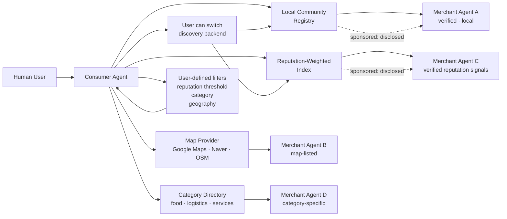

# ARC Protocol: Discovery Topology

> **Purpose:** Visual reference for ARC's multi-backend discovery model
> For discovery layer detail, see [docs/architecture.md](../docs/architecture.md).
> For sponsored discovery and manipulation risks, see [docs/threat-model.md](../docs/threat-model.md).

## Topology Diagram

## Notes

- Any discovery backend may include sponsored placement, but disclosure is required.
- Users may switch backends freely. This is a core anti-monopoly design feature.
- No single backend is mandatory or canonical.
- Reputation indexes and local registries may overlap. The consumer agent may query multiple sources.
- This topology is illustrative. Real deployments may vary based on community and region.
