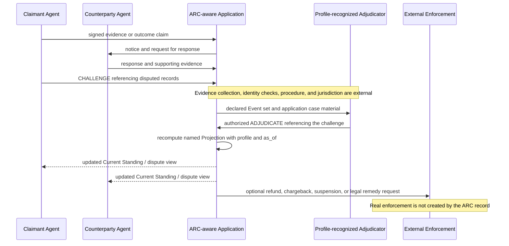

# ARC Commerce Application: Dispute Evidence Flow

> **Status:** Non-normative application diagram
> **Purpose:** Separate ARC challenge/adjudication records and recomputation
> from the institutions that investigate facts and enforce remedies.

## Boundary

- `CHALLENGE` records a signed contest; it does not prove the claimant is right.
- `ADJUDICATE` records a decision by an authority recognized under a named
  profile; it does not create institutional or legal legitimacy.
- Conflicting or causally unresolved records may remain `CONTESTED`.
- A later recognized adjudication may change a named Projection without erasing
  the earlier evidence.
- Appeals may be represented as a new `CHALLENGE` referencing a prior
  `ADJUDICATE`, but notice, deadlines, review bodies, and appeal rights belong to
  the external institution.
- Refunds, chargebacks, contractual remedies, account suspension, and legal
  enforcement remain application, payment-provider, marketplace, contractual,
  regulatory, or court responsibilities.

See [Governance](../docs/governance.md),
[Reputation](../docs/reputation.md), and
[Liability Boundaries](../docs/liability-boundaries.md).
