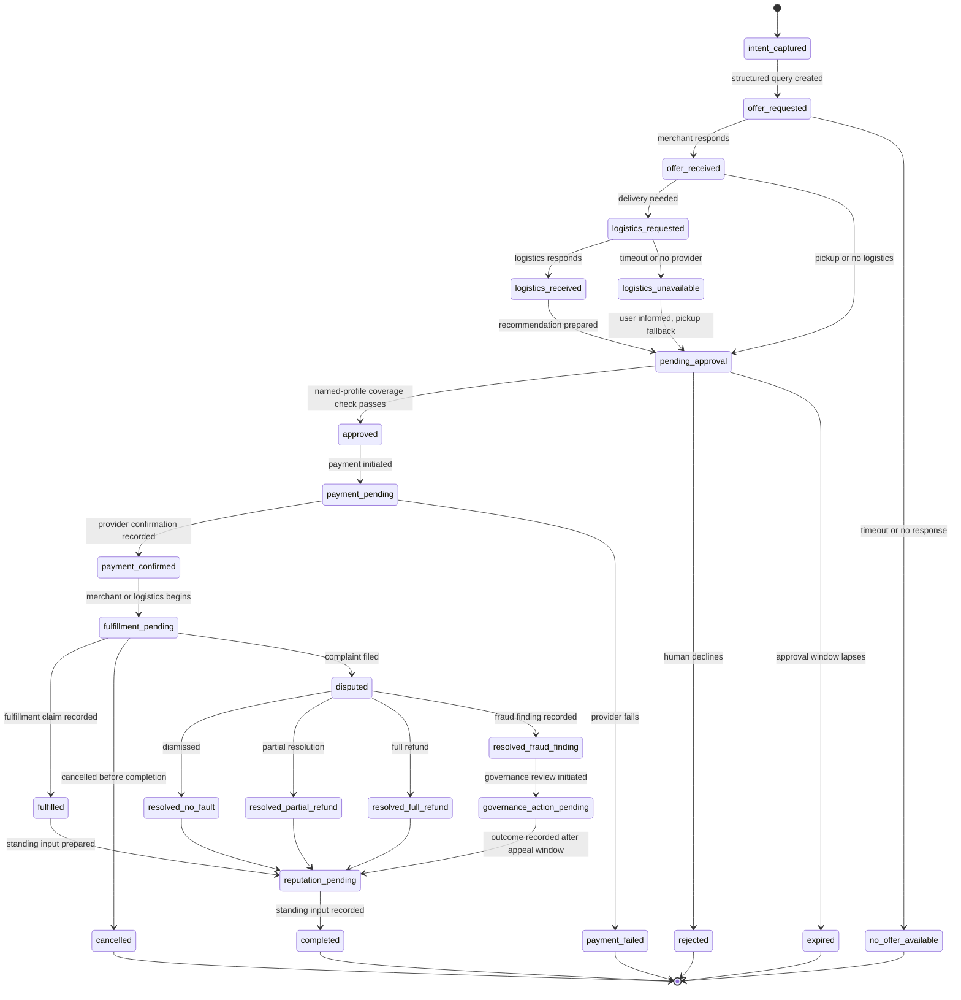

# ARC Historical Commerce Application: Transaction Lifecycle

> **Status:** Frozen, non-normative application example
> **Purpose:** Visual reference for the Commerce Projection exercised by the mock
> corpus; not an active product workflow or ARC base-protocol state machine.
> These application states are not additional ARC Canon Event types.
> For message flow detail, see [protocol.md](../docs/protocol.md).

## State Diagram

## Notes

- `logistics_unavailable` resolves to `pending_approval` rather than terminating, because pickup fallback may still be available.
- `resolved_fraud_finding` moves into `governance_action_pending` because adjudicated application findings may require suspension, appeal, or cross-community review before final closure.
- Dispute states feed back into `reputation_pending` to record application outcome claims as evidence.
- State labels summarize recorded claims and application findings; they are not outcome proof.
- This diagram reflects the frozen historical profile in `protocol.md`. It is
  retained to explain the executable fixtures, not as an active design roadmap.
