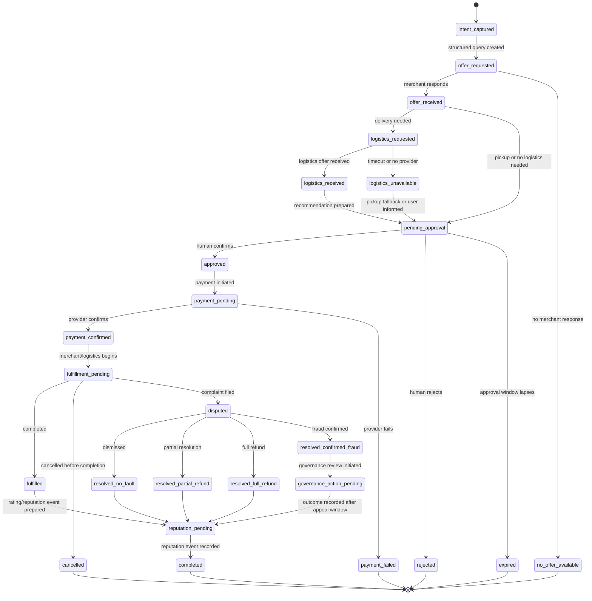
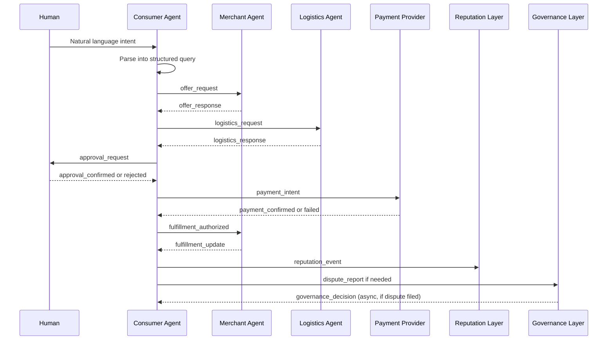

# ARC Protocol: Protocol Mechanics

> **Status:** Exploratory draft
> **Purpose:** Transaction lifecycle, message flow, state transitions, and failure modes
> For architecture overview, see [architecture.md](./architecture.md).

---

## 1. Scope

This document is not a finalized protocol rulebook. It describes early mechanics for human-approved agent commerce and identifies the transaction boundaries that an implementation would need to test.

ARC remains exploratory. The purpose of this draft is to make questions about messages, states, timeouts, and failures concrete enough for review without claiming that one schema or transport is complete.

## 2. Design Constraints

- **Human approval before meaningful payment.** An agent may prepare an action, but meaningful economic action should remain subject to explicit human confirmation.
- **Typed structured messages.** Negotiation should operate on inspectable message types rather than unrecorded conversational assumptions.
- **Signed offers and approvals where manipulation resistance matters.** Signatures may help establish which party presented or approved a material term.
- **Timeout-aware negotiation.** Requests, offers, and approval windows may expire and should be handled explicitly.
- **Failure-first design.** Missing responses, stale offers, failed payments, delivery problems, and disputes are normal protocol concerns, not edge cases to ignore.
- **DB-first / blockchain-minimal.** Normal databases and existing payment infrastructure remain the primary path; blockchain is optional only where a shared checkpoint is justified.
- **Community-visible dispute records where appropriate.** Verified dispute outcomes may inform trust while privacy and jurisdictional constraints remain under review.

## 3. Core Actors

| Actor | Early Role |
| --- | --- |
| Consumer Agent | Captures a human intent, prepares structured requests, compares offers, and requests approval. |
| Merchant Agent | Returns price, availability, conditions, and fulfillment updates for a merchant. |
| Logistics Agent | Returns delivery or pickup options where logistics are needed. |
| Human Approver | Reviews material terms and confirms or rejects the proposed transaction. |
| Payment Provider | Processes payment only after the required approval step. |
| Reputation Layer | Records relevant verified outcomes and reputation events. |
| Community Governance Layer | Reviews disputes, reports, and community-level trust decisions where applicable. |

## 4. Canonical Transaction Lifecycle



This lifecycle is a starting model. Particular communities or services may need additional states, especially around partial fulfillment, cancellation rights, refunds, and regulated transactions.

## 5. Message Lifecycle



The diagram describes one successful-path conversation with an optional dispute report. A practical implementation should also support absent messages, cancellation, retry, and dispute escalation.

## 6. Message Types

The following message types describe intended roles, not a finalized schema.

| Type | Purpose | Notes |
| --- | --- | --- |
| `intent_record` | Preserve the original human request and its canonical interpretation. | Should distinguish original expression from parsed fields. |
| `offer_request` | Ask a merchant for price, availability, and conditions. | Should reference the canonical intent and a response window. |
| `offer_response` | Return a merchant offer. | Should include material terms, `expires_at`, and a signature where relied upon. |
| `logistics_request` | Ask for pickup or delivery availability. | Needed only where fulfillment involves logistics. |
| `logistics_response` | Return timing, fee, and delivery conditions. | May expire independently of a merchant offer. |
| `approval_request` | Present a selected option to the human. | Should show material terms and relevant expiry. |
| `approval_confirmed` | Record human confirmation. | Should identify exactly which non-expired offer was approved. |
| `approval_rejected` | Record that the human declined. | Ends or revises the proposed flow. |
| `payment_intent` | Initiate provider payment after approval. | Must not precede required human approval. |
| `payment_confirmed` | Record provider-confirmed payment. | Authorizes subsequent fulfillment handling. |
| `payment_failed` | Record failed or declined payment. | Fulfillment should not proceed on an unconfirmed payment. |
| `fulfillment_authorized` | Notify merchant/logistics that fulfillment may begin after payment confirmation. | Should only be sent after approval and confirmed payment where payment is required. |
| `fulfillment_update` | Report preparation, pickup, delivery, or service state. | May support cancellation or dispute review. |
| `cancellation_notice` | Notify parties that a transaction or offer is cancelled. | Treatment depends on approval and payment state. |
| `reputation_event` | Record a relevant transaction outcome or rating. | Verification and privacy rules remain open. |
| `dispute_report` | File a complaint with relevant evidence. | May attach signed transaction records. |
| `governance_decision` | Record community review outcome. | Should be subject to local policy and appeal rules. |

## 7. Structured Intent and Parsing Problem

Natural language requests are convenient for humans but unstable as protocol input. Two agents may parse the same request differently, and the same LLM may produce different structured outputs across runs. ARC should therefore distinguish between the original human expression and the canonical structured intent used for negotiation.

```json
{
  "intent_id": "intent_001",
  "original_text": "Find me coffee and a sandwich nearby under $10.",
  "canonical_intent": {
    "category": "food_order",
    "items": ["coffee", "sandwich"],
    "max_total_price": 10.00,
    "currency": "USD",
    "location_scope": "nearby",
    "delivery_required": true
  },
  "created_by": "consumer_agent_abc",
  "requires_human_review": true
}
```

The canonical intent should be shown to the human when ambiguity matters. Human correction should update the canonical intent before offer negotiation continues.

## 8. Offer Expiration and Stale Offers

- Every offer should include an `expires_at` value.
- Expired offers must not be approved.
- If approval happens after expiry, the consumer agent should request a refreshed offer.
- Merchants may cancel unavailable offers before approval.
- Cancellation after approval enters a cancellation or dispute flow depending on payment state and applicable rules.

Expiration protects both people and merchants from approval based on prices, stock, or delivery terms that are no longer available. This draft does not yet define a universal expiration period.

## 9. Timeout, Retry, and Failure Modes

| Failure Mode | Example | Recommended Handling |
| --- | --- | --- |
| Merchant no response | No `offer_response` before timeout | Mark unavailable, try alternatives. |
| Logistics timeout | No `logistics_response` | Inform user, fall back to pickup or retry. Route to `pending_approval`. |
| Stale offer | Human approves after `expires_at` | Require refreshed offer. |
| Duplicate offer | Same merchant sends conflicting offers | Use latest signed offer or ask merchant to clarify. |
| Payment failure | Provider declines payment | Stop fulfillment, notify human. |
| Fulfillment delay | Merchant or logistics misses estimate | Update status, allow cancellation or dispute. |
| Agent disconnect | Relay/WebRTC failure | Retry through fallback or async inbox. |
| Dispute after completion | User claims misrepresentation | Attach signed logs to governance review. |

Retry behavior should avoid silently converting a failed or expired proposal into an approved transaction. Implementations should make consequential failures visible to the human and relevant parties.

## 10. Async Inbox and Dead Letter Handling

Not all commerce requires real-time negotiation. For slower services, an asynchronous inbox, webhook, or polling flow may be sufficient and may reduce the operational burden of persistent communication.

A message that cannot be delivered after retries may enter a dead-letter queue. Dead-letter records should be visible to relevant parties and should not silently disappear. This matters where failure to deliver an approval, cancellation, or dispute message could change a party's expectations or rights.

## 11. Known Tensions and Trade-offs

### Cold Start vs Sybil Resistance

New participants may need a visible path to first transactions, while automatically promoting arbitrary new agents would invite Sybil abuse. The current ARC position is that any cold-start discovery support should be limited to clearly labeled, appropriately verified entrants and remain subject to human choice.

### Automatic Approval vs Governance Burden

Automation can reduce repetitive approval friction, but it can also create unclear responsibility and more disputes when an action goes wrong. The current ARC position is manual human approval for meaningful payments, with any narrow pre-authorization concept remaining exploratory, explicit, and auditable.

### Low Merchant Cost vs Discovery Sustainability

Small merchants may benefit from lower intermediary overhead, but directories, relays, curation, and moderation still cost time and money. The current ARC position is to examine transparent and non-extractive operation models without claiming that participation or infrastructure will be free.

### Recommendation Logs vs Real Understanding

An agent can log why it selected an offer, but a log is not proof that a human understood every trade-off or that the recommendation was fair. The current ARC position is to make material terms and reasoning inspectable while treating explainability quality as an unresolved design problem.

### Open Discovery vs Backend Concentration

Open protocol rules do not prevent popular discovery backends from accumulating influence. The current ARC position is to support replaceable backends, disclosed sponsorship, and visible ranking signals while recognizing that actual concentration risks require continued scrutiny.

### Privacy vs Auditability

Dispute review and reputation portability may benefit from durable records, while transaction logs can contain sensitive personal and commercial information. The current ARC position is minimum necessary disclosure with privacy-preserving audit methods still to be explored.

### Local Governance vs Capture Risk

Local governance can reflect context and enable practical review, but established actors may capture it or exclude newcomers. The current ARC position is to keep appeal, transparency, and anti-capture safeguards as core design questions rather than assume local control is inherently fair.

## 12. Known Unknowns

- final canonical schema
- multi-language and locale support
- jurisdiction-specific credential rules
- cross-community dispute escalation
- privacy-preserving audit logs
- reputation portability limits
- relay operator accountability
- payment provider integration differences
- offline merchant bridge
- physical logistics automation boundaries

## 13. Current Status

This document is an exploratory protocol draft. No implementation exists. The next useful contribution is a small local-commerce simulation that tests this lifecycle with mock agents, mock payment, and human approval.
